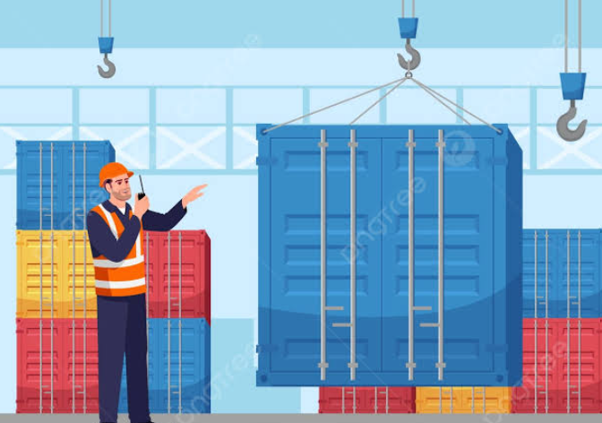
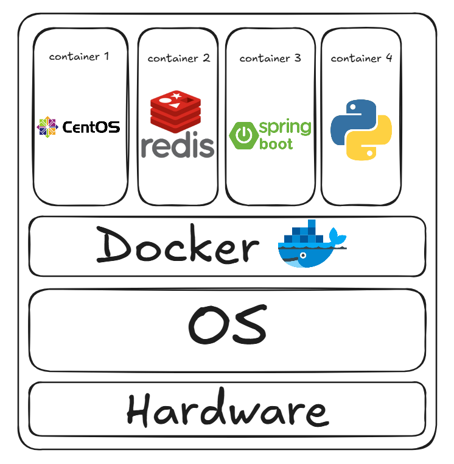
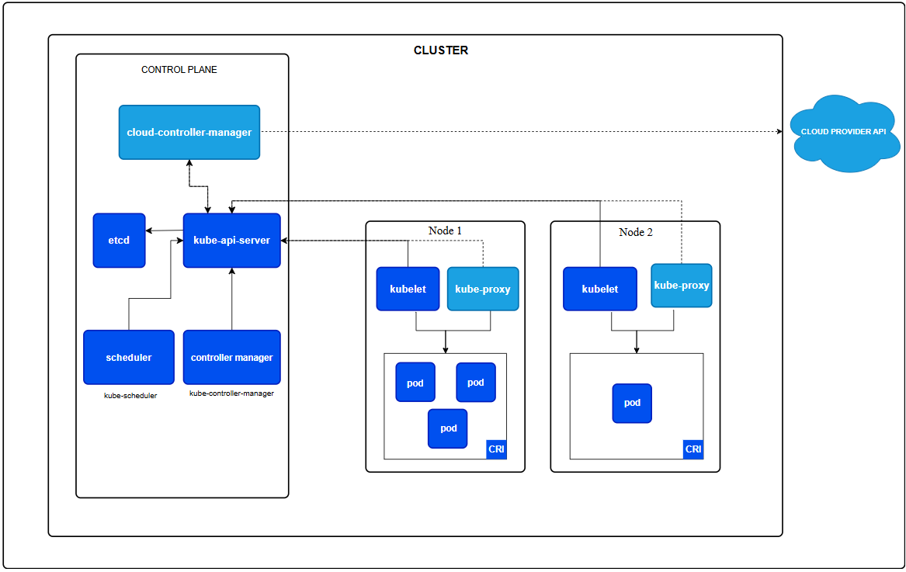

# Docker 101

This repository is designed to guide you through Docker from the absolute basics to a good level. Each section builds upon the previous one, so please follow the flow sequentially.

---

## Table of Contents

1. [Why Do We Need Docker?](#why-do-we-need-docker)
2. [Dockerfile Build Up (Main Keywords)](#dockerfile-build-up-main-keywords)
3. [Docker CLI](#docker-cli)
4. [Docker Compose](#docker-compose)
5. [Intro to K8s](#intro-to-k8s)

---

## Why Do We Need Docker?

### The Problem We're Solving

Before Docker, deploying applications was extremely painful:

**Traditional Deployment Issues:**
- **"Works on my machine"**: An application runs perfectly on your laptop but fails on the production server
- **Environment inconsistency**: Different versions of Python, Node, Java, databases, or system libraries on different machines
- **Dependency hell**: Installing application A might break application B because they need different versions of a shared library
- **Slow onboarding**: New developers had to spend hours setting up the exact environment to run the project locally
- **Resource waste**: Virtual machines required to isolate applications consumed massive amounts of memory and disk space
- **Difficult scaling**: Running multiple copies of an application required significant infrastructure setup

### What is Docker?

Docker is a **containerization platform** that packages your entire application with all its dependencies (code, runtime, system tools, libraries) into a single standardized unit called a **container**.

A **Docker** is someone who works in a port loading and unloading cargo ships (a dockworker or longshoreman). The software was named this because its core purpose is to "package, ship, and handle" software applications in isolated boxes (called containers), just like cargo ships do.

<div align="center">
  <p align="center">
    
  </p>
<p align="center">
<strong>Image source: https://pngtree.com/freepng/dock-worker-semi-flat-vector-illustration-design-vector-simple-vector_10390520.html</strong></p>
</div>


### Key Benefits

1. **Consistency**: The same container runs identically on your laptop, your colleague's machine, staging, and production
2. **Isolation**: Applications run in isolated environments without interfering with each other
3. **Lightweight**: Containers share the host OS kernel, making them much faster and lighter than virtual machines (typically 50-100MB vs 1-10GB for VMs)
4. **Portability**: "Build once, run anywhere" - your Docker image works the same everywhere Docker is installed
5. **Efficiency**: Multiple containers can run on a single machine, utilizing resources much better than VMs
6. **Speed**: Containers start in milliseconds, VMs take minutes

### Docker Analogy

Think of Docker like shipping containers in the real world:
- **Without Docker (Traditional shipping)**: You'd send your product loose in the truck, and the receiving end has to guess how to pack it, what tools to use, what environment it needs, etc.
- **With Docker (Container shipping)**: Your product is packed in a standardized container with all necessary equipment and instructions. It fits the same way whether it's on a truck, train, or ship.

### Architecture Overview

<div align="center">
  <p align="center">
    
  </p>
<p align="center">
<strong>Docker architecture with different containers up and running</strong></p>
</div>

All containers share the same kernel, but each container has its own:
- File system
- Environment variables
- Network namespace
- Process namespace

---

## Dockerfile Build Up (Main Keywords)

A **Dockerfile** is a text file containing instructions to build a Docker image. Think of it as a recipe that specifies exactly how to create your application's container.

### Core Concepts

* **Image**: A blueprint or template (immutable, read-only)
* **Container**: A running instance of an image (mutable, live in the RAM)
* **Dockerfile**: Instructions to build an image
* **Build**: The process of creating an image from a Dockerfile

### Main Keywords (Instructions)

#### 1. **FROM** - Set the Base Image
```dockerfile
FROM python:3.9-slim
```
- **Purpose**: Specifies the starting point for your image
- **Mandatory**: Must be the first instruction (except comments)
- **What it does**: Pulls a pre-built image from Docker Hub with Python 3.9 already installed
- **Why it matters**: You don't build from scratch; you build on top of existing images
- **Common bases**:
  - `ubuntu:22.04` - Full Linux OS
  - `python:3.9` - Python pre-installed
  - `node:18-alpine` - Node.js with Alpine (tiny Linux)
  - `openjdk:11` - Java pre-installed
  - `alpine:latest` - Minimal Linux (~5MB)

#### 2. **WORKDIR** - Set Working Directory
```dockerfile
WORKDIR /app
```
- **Purpose**: Sets the working directory inside the container
- **Analogy**: Like `cd /app` in Linux
- **What it does**: Creates the directory if it doesn't exist and switches to it
- **Why it matters**: Organizes files logically inside the container
- **Impact**: All subsequent commands (RUN, COPY, CMD) execute from this directory

#### 3. **COPY** - Copy Files from Host to Container
```dockerfile
COPY requirements.txt .
```
- **COPY**: Copies files from your computer (host) into the container
- **What it does**: Takes `requirements.txt` from your current directory and places it in the container's `/app` directory (the `.` refers to WORKDIR)
- **Why it matters**: Gets your application code and config files into the container

#### 4. **RUN** - Execute Commands
```dockerfile
RUN pip install -r requirements.txt
```
- **Purpose**: Runs shell commands inside the container during build
- **Layer concept**: Each RUN creates a new layer in your image (important for optimization)
- **Best practice**: Combine multiple commands with `&&` to reduce layers:
  ```dockerfile
  RUN apt-get update && apt-get install -y git curl && rm -rf /var/lib/apt/lists/*
  ```

#### 5. **EXPOSE** - Document Open Ports
```dockerfile
EXPOSE 5000
```
- **Purpose**: Documents which port the application listens on
- **Important**: Does NOT actually open the port (informational only)
- **Port mapping**: When running the container, you map this with: `docker run -p 5000:5000 myimage`
- **Why it matters**: Helps others understand which ports to expose

#### 6. **ENV** - Set Environment Variables
```dockerfile
ENV DATABASE_URL=postgres://db:5432/myapp
ENV DEBUG=true
```
- **Purpose**: Sets environment variables available to the running container
- **Use cases**: Database URLs, API keys, debug flags, feature flags
- **Accessible**: From within the container as normal environment variables
- **Override**: Can be overridden at runtime with: `docker run -e DEBUG=false`

#### 7. **CMD** - Default Command
```dockerfile
CMD ["python", "app.py"]
```
- **Purpose**: Specifies the default command to run when container starts
- **Format options**:
  - Exec form (preferred): `CMD ["python", "app.py"]`
  - Shell form: `CMD python app.py`
- **Only one**: Only the last CMD instruction is executed
- **Overridable**: Can be overridden when running: `docker run myimage bash`

#### 8. **ENTRYPOINT** - Configure Container as Executable
```dockerfile
ENTRYPOINT ["python"]
CMD ["app.py"]
```
- **Purpose**: Makes the container behave like an executable
- **Difference from CMD**: ENTRYPOINT runs always, CMD can be overridden
- **Common pattern**: Use ENTRYPOINT for the main program, CMD for default arguments
- **Example**: With above, `docker run myimage different_file.py` would run `python different_file.py`

#### 9. **USER** - Set Running User
```dockerfile
RUN useradd -m appuser
USER appuser
```
- **Purpose**: Specifies which user runs the container
- **Default**: If not specified, container runs as root (risky)
- **Impact**: Subsequent RUN, CMD, ENTRYPOINT run as this user

#### 10. **VOLUME** - Define Mount Points
```dockerfile
VOLUME ["/data"]
```
- **Purpose**: Marks a directory as a volume (persistent storage outside container)
- **Use case**: Database data, logs, user uploads
- **Effect**: Data in this directory persists even after container stops
- **Mount**: Explicitly mount when running: `docker run -v /my/host/path:/data myimage`

#### 11. **ARG** - Build-time Variables
```dockerfile
ARG BUILD_DATE
RUN echo "Built on $BUILD_DATE"
```
- **Purpose**: Variables available only during build time (unlike ENV for runtime)
- **Use case**: Different build configurations, version numbers
- **Runtime**: Not available inside running container
- **Override**: Pass at build time: `docker build --build-arg BUILD_DATE="2026-01-01" .`

### Dockerfile Build Process

When you run `docker build -t myimage .`, Docker:

1. Reads the Dockerfile line by line
2. For each instruction:
   - Creates a temporary container
   - Executes the instruction
   - Commits the result as a new layer
   - Removes the temporary container
3. Final layer becomes your image
4. Tags it with the name you provided

This layered approach enables:
- **Caching**: If a layer hasn't changed, Docker reuses it (fast rebuilds)
- **Efficiency**: Shared layers across images save disk space

### Best Practices for Dockerfiles

1. **Order matters for caching**:
   ```dockerfile
   # ✅ GOOD: Changes least often come first
   FROM python:3.9
   RUN pip install requests numpy  # Rarely changes
   COPY requirements.txt .          # Changes sometimes
   RUN pip install -r requirements.txt
   COPY . .                          # Changes often
   ```

2. **Use .dockerignore**: Exclude files from COPY (like .git, node_modules)
   ```
   # .dockerignore
   .git
   node_modules
   __pycache__
   .env
   ```

3. **Minimize layers**: Combine RUN commands with `&&`

4. **Use specific versions**: Avoid `FROM python:latest` (unpredictable)

5. **Keep images small**: Use small base images, remove build dependencies

6. **Don't run as root**: Create a user for security

---

## Docker CLI

The Docker Command Line Interface (CLI) is how you interact with Docker. Here are the essential commands:

### Image Management

#### `docker build` - Build an image from Dockerfile
```bash
docker build -t myimage:1.0 .
```
- `-t`: Tag (name:version)
- `.`: Build context (current directory containing Dockerfile)

#### `docker images` - List all images
```bash
docker images
REPOSITORY    TAG         IMAGE ID      CREATED       SIZE
myimage       1.0         abc123def456  2 hours ago   256MB
python        3.9-slim    xyz789abc123  2 weeks ago   125MB
```

#### `docker pull` - Download image from registry
```bash
docker pull ubuntu:22.04
docker pull ghcr.io/myorg/myapp:latest
```

#### `docker push` - Upload image to registry
```bash
docker push myregistry.com/myapp:1.0
```

#### `docker rmi` - Remove image
```bash
docker rmi myimage:1.0
docker rmi -f myimage:1.0  # Force remove
```

#### `docker tag` - Create alias for image
```bash
docker tag myimage:1.0 myimage:latest
```

### Container Management

#### `docker run` - Create and start a container
```bash
docker run -d --name mycontainer -p 8080:5000 -e DEBUG=true myimage:1.0

# Flags explained:
# -d                 : Detached mode (background)
# --name             : Container name
# -p 8080:5000       : Port mapping (host:container)
# -e DEBUG=true      : Environment variable
# -v /host:/container: Volume mount
# -it                : Interactive terminal
# --rm               : Auto-remove when stopped
```

#### `docker ps` - List running containers
```bash
docker ps                    # Running containers
docker ps -a                 # All containers (including stopped)
```

#### `docker logs` - View container output
```bash
docker logs mycontainer
docker logs -f mycontainer   # Follow (like tail -f)
docker logs --tail 50 mycontainer # Get latest 50 lines
```

#### `docker exec` - Run command in running container
```bash
docker exec mycontainer ls -la
docker exec -it mycontainer bash  # Interactive shell
```

#### `docker stop` - Stop running container
```bash
docker stop mycontainer
docker stop $(docker ps -q)  # Stop all containers
```

#### `docker start` - Start stopped container
```bash
docker start mycontainer
```

#### `docker rm` - Remove container
```bash
docker rm mycontainer
docker rm $(docker ps -aq)   # Remove all containers
```

#### `docker inspect` - Detailed info about container
```bash
docker inspect mycontainer
docker inspect mycontainer | grep IPAddress
```

### Useful Commands

#### `docker stats` - Monitor resource usage
```bash
docker stats
```

#### `docker top` - List processes in container
```bash
docker top mycontainer
```

#### `docker commit` - Create image from container
```bash
docker commit mycontainer myimage:custom
```

#### `docker history` - Show image layers
```bash
docker history myimage:1.0
```

#### `docker cp` - Copy files between host and container
```bash
docker cp mycontainer:/app/data.txt ./
docker cp ./local.txt mycontainer:/app/
```

### Registry & Hub

#### `docker login` - Login to Docker registry
```bash
docker login
docker login myregistry.com
```

#### `docker search` - Search Docker Hub
```bash
docker search ubuntu
```

---

## Docker Compose

**Docker Compose** allows you to define and run multi-container applications. Instead of running multiple `docker run` commands, you write a `docker-compose.yml` file.

### Why Docker Compose?

Imagine you need:
- A web application (Node.js)
- A database (PostgreSQL)
- A cache (Redis)

Without Docker Compose:
```bash
docker run -d --name db -e POSTGRES_PASSWORD=secret postgres:14
docker run -d --name cache redis:7
docker run -d --name web -p 8080:3000 --link db --link cache myapp:1.0
```

With Docker Compose:
```bash
docker-compose up
```

Much simpler!

### Docker Compose Workflow

1. **Define services** in `docker-compose.yml`
2. **Run**: `docker-compose up`
3. **Stop**: `docker-compose down`
4. **View logs**: `docker-compose logs`

### Key Concepts

**Service**: A container-based application (web, db, cache, etc.)
**Networking**: Services automatically can reach each other by service name
**Volumes**: Persistent data storage across containers
**Environment**: Shared or service-specific configuration

### Essential Commands

```bash
docker-compose up              # Start all services
docker-compose up -d           # Start in background
docker-compose down            # Stop and remove containers
docker-compose logs            # View all logs
docker-compose logs web        # View specific service logs
docker-compose exec web bash   # Execute command in service
docker-compose ps              # List services
docker-compose build           # Build images for services
docker-compose restart         # Restart all services
docker-compose pause           # Pause all services
docker-compose unpause         # Resume all services
```

### Example Structure

```yaml
version: '3.8'

services:
  web:
    build: .
    ports:
      - "8080:3000"
    environment:
      DATABASE_URL: postgresql://db:5432/myapp
    depends_on:
      - db
    volumes:
      - ./src:/app/src

  db:
    image: postgres:14
    environment:
      POSTGRES_PASSWORD: secret
    volumes:
      - db_data:/var/lib/postgresql/data

volumes:
  db_data:
```

### Key YAML Properties

- **build**: Build image from Dockerfile
- **image**: Use pre-built image
- **ports**: Expose ports (host:container)
- **environment**: Environment variables
- **volumes**: Mount directories or named volumes
- **depends_on**: Startup order dependency
- **networks**: Custom networking
- **restart_policy**: Auto-restart on failure
- **command**: Override default command
- **healthcheck**: Monitor container health

---

## Intro to K8s

**Kubernetes (K8s)** is an orchestration platform for containerized applications. When you have dozens or hundreds of containers, Kubernetes automates deployment, scaling, and management.

### Why Kubernetes?

Imagine you have 100 Docker containers running your application across 10 servers. You need to:

1. **Deployment**: Place the right containers on the right servers
2. **Scaling**: Add more containers when traffic increases
3. **Health checks**: Restart containers that crash
4. **Rolling updates**: Update to a new version without downtime
5. **Load balancing**: Distribute traffic across containers
6. **Resource management**: Ensure servers don't run out of CPU/memory

Doing this manually is very hard. Kubernetes automates all of it.

### Key Kubernetes Concepts

#### **Cluster**
A set of machines (nodes) running Kubernetes. One master node orchestrates, worker nodes run containers.

#### **Pod**
The smallest unit in Kubernetes. Usually wraps one container (can have multiple containers that need to live together).

```yaml
apiVersion: v1
kind: Pod
metadata:
  name: myapp-pod
spec:
  containers:
  - name: myapp
    image: myapp:1.0
    ports:
    - containerPort: 8080
```

#### **Deployment**
Defines desired state: how many replicas, which image, how to update.

```yaml
apiVersion: apps/v1
kind: Deployment
metadata:
  name: myapp
spec:
  replicas: 3
  selector:
    matchLabels:
      app: myapp
  template:
    metadata:
      labels:
        app: myapp
    spec:
      containers:
      - name: myapp
        image: myapp:2.0
        ports:
        - containerPort: 8080
```

Kubernetes will ensure 3 pods are always running. If one crashes, it restarts automatically.

#### **Service**
Exposes pods to other pods or external traffic.

```yaml
apiVersion: v1
kind: Service
metadata:
  name: myapp-service
spec:
  type: LoadBalancer
  selector:
    app: myapp
  ports:
  - protocol: TCP
    port: 80
    targetPort: 8080
```

Different service types:
- **ClusterIP**: Internal communication only
- **NodePort**: Exposes on each node's IP
- **LoadBalancer**: Cloud provider's load balancer
- **ExternalName**: DNS alias to external service

#### **ConfigMap & Secret**
Store configuration and secrets.

```yaml
apiVersion: v1
kind: ConfigMap
metadata:
  name: app-config
data:
  database_host: "postgres.default.svc.cluster.local"
  debug_mode: "false"

---

apiVersion: v1
kind: Secret
metadata:
  name: app-secrets
type: Opaque
data:
  password: cGFzc3dvcmQxMjM=  # base64 encoded
```

#### **Namespace**
Logical isolation. Like folders for Kubernetes resources.

### Kubernetes Workflow

1. **Write YAML manifests** (Pod, Deployment, Service)
2. **Apply to cluster**: `kubectl apply -f deployment.yaml`
3. **Kubernetes schedules** Pods on available nodes
4. **Monitors and self-heals** (restarts crashed Pods, scales replicas)
5. **Handles updates** (rolling deployments with zero downtime)

### Essential Kubectl Commands

```bash
kubectl get pods                    # List pods
kubectl get deployments             # List deployments
kubectl describe pod myapp-pod      # Detailed info
kubectl logs myapp-pod              # View logs
kubectl exec -it myapp-pod -- bash  # Shell access
kubectl apply -f deployment.yaml    # Deploy
kubectl delete deployment myapp     # Remove deployment
kubectl scale deployment myapp --replicas=5  # Scale
kubectl rollout status deployment/myapp      # Check update status
kubectl port-forward pod/myapp-pod 8080:8080 # Port forwarding
```

### High-Level Kubernetes Architecture


<div align="center">
  <p align="center">
    
  </p>
<p align="center">
<strong>Kubernates high-level architecture</strong></p>
</div>

### Next Steps for K8s Learning

1. **Install locally**: Docker Desktop includes Kubernetes
2. **Start with Deployments**: The most common use case
3. **Learn Services**: How pods expose traffic
4. **Understand StatefulSets**: For databases and persistent data
5. **Explore Ingress**: Advanced routing
6. **Consider managed services**: AWS EKS, GCP GKE, Azure AKS

---

## Quick Reference: Docker vs Compose vs Kubernetes

| Aspect | Docker | Docker Compose | Kubernetes |
|--------|--------|----------------|-----------|
| **Scope** | Single container | Multi-container on one host | Multi-container across cluster |
| **Use case** | Development, single app | Local development, small deployments | Production, large scale |
| **Setup** | Easy | Very easy | Complex |
| **Learning curve** | Beginner | Beginner-Intermediate | Intermediate-Advanced |
| **Scaling** | Manual | Manual | Automatic |
| **Self-healing** | No | No | Yes |
| **Best for** | Learning | Local dev, testing | Production |

---

## Interactive Labs

You can find here a very cool interactive labs that may help you to practice with docker commands: [Click Me](https://kodekloud.com/studio/labs/docker)

---

## Resources

- [Docker Hub](https://hub.docker.com/)
- [Play with Docker](https://www.docker.com/play-with-docker/)
- [Docker Official Documentation](https://docs.docker.com/)
- [Kubernetes Official Documentation](https://kubernetes.io/docs/)

